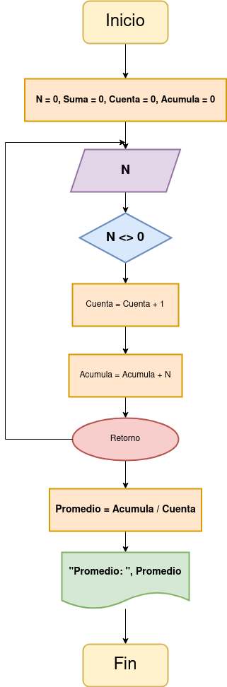

# Ejercicio 8

<!-- Recuerda que

## 1. Subtítulo tarea

### 1.1 Subtítulo de la tarea

-- Incluir imagenes

     

-->

## Descripción del ejercicio
Desarrolle un algoritmo que permita calcular Promedio de Notas; finaliza cuando N = 0.
## Diagrama de flujos
    
## Pseudocódigo
 - __Inicio__
 - Declaración de variables:
    N = 0, Promedio = 0, Acumula = 0
 - Leer N
 - __Mientras__ N <> 0 hacer
 -      Cuenta = Cuenta + 1
 -      Acumula = Acumula + N
 - __Fin Mientras__
 - Promedio = Acumula / Cuenta
 - Imprimir "Promedio"; Promedio
 - __Fin__
 
## Referencias

