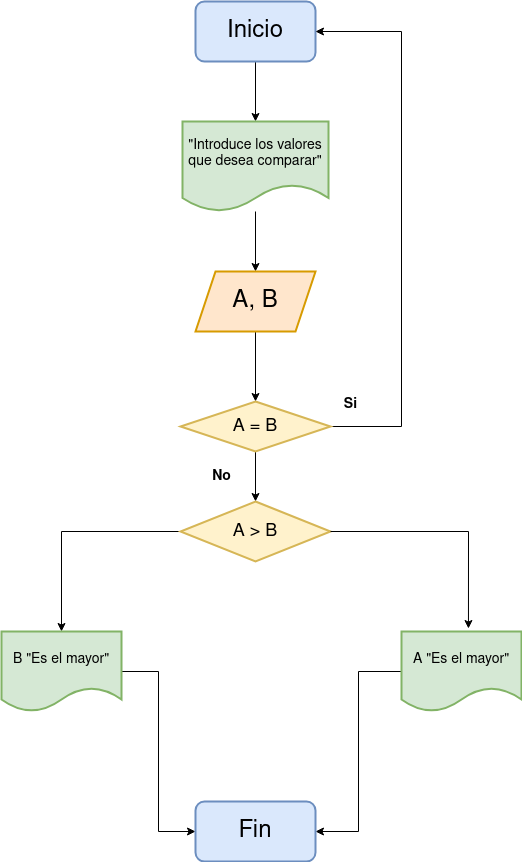

# Ejercicios

- [Ejercicio 1](#ejercicio1)

## Ejercicio 1 
Desarrolle un algoritmo que permita leer dos valores distintos, determinar cual de los dos valores es el mayor y escribirlo.

### Diagrama de flujo

### Pseudocógido

Pasos:
 - __Inicio__
 - Inicializar las variables A, B y C
 - __Leer__ los tres valores
 - Almacenar en las variables A, B y C
 - __Si__ A > B y A > C __Entonces__
 - __Escribir__ A "Es el mayor"
 - __Sino__
 - __Si__ B > A y B > C __Entonces__
 - __Escribir__ B "Es el mayor"
 - __Sino__
 - __Escribir__ C "Es el mayor"
 - __Fin_Si__
 - __Fin_Si__
 - __Fin__

