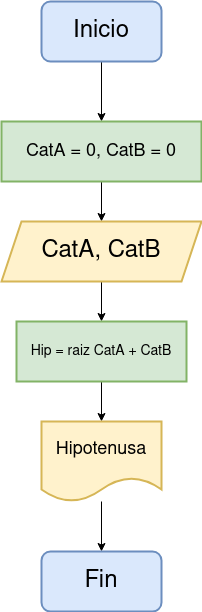

# Ejercicio 4 

<!-- Recuerda que

## 1. Subtítulo tarea

### 1.1 Subtítulo de la tarea

-- Incluir imagenes

     

-->

## Descripción del ejercicio

Desarrolle un algoritmo que permita leer un valor cualquiera N y escriba si dicho número es par o impar.

## Diagrama de flujos

## Pseudocódigo

Pasos:
- __Inicio__
- Declaracion de Variables:
    CatA = 0, CatB = 0
- __Leer__ el valor de cada cateto
- Almacenar en las variables CatA y CatB
- __Calcular__ el valor de Hip con la formula indicada 
- __Escribir__ el valor de la Hipotenusa
- __Fin__

## Referencias

