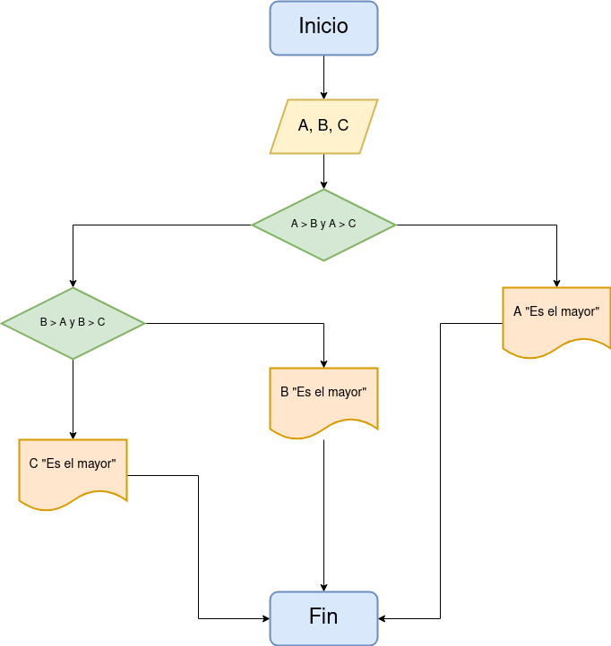

<<<<<<< HEAD
# Ejercicio 2 
=======
# Ejercicio 5 
>>>>>>> dca314d0a273fbcf8120dc8b1d1a3cf9ff32fe48

<!-- Recuerda que

## 1. Subtítulo tarea

### 1.1 Subtítulo de la tarea

-- Incluir imagenes

     

-->

## Descripción del ejercicio
<<<<<<< HEAD
Desarrolle un algoritmo que permita leer tres valores y almacenarlos en las variables A, B y C respectivamente. El algoritmo debe imprimir cual es el mayor y cual es el menor. Recuerde constatar que los tres valores introducidos por el teclado sean valores distintos. Presente un mensaje de alerta en caso de que se detecte la introducción de valores iguales.
=======

Desarrolle un algoritmo que permita leer dos números y ordenarlos de menor a mayor, si es el caso.
>>>>>>> dca314d0a273fbcf8120dc8b1d1a3cf9ff32fe48

## Diagrama de flujos

## Pseudocódigo

Pasos:
- __Inicio__
<<<<<<< HEAD
- Inicializar las variables A, B y C
- __Leer__ los tres valores
- Almacenar en las variables A, B y C
- __Si__ A > B y A > C __Entonces__
- __Escribir__ A "Es el mayor"
- __Sino__
- __Si__ B > A y B > C __Entonces__
- __Escribir__ B "Es el mayor"
- __Sino__
- __Escribir__ C "Es el mayor"
- __Fin_Si__
- __Fin_Si__
=======
- Declaracion de variables:
    R = 0, H = 0
- __Leer__ el valor de Radio (R) y Altura (H)
- __Calcular__ el Volumen aplicando la formula
- __Calcular__ el valor del area aplicando la formula respectiva
- __Escribir__ el valor del Area y del Volumen
>>>>>>> dca314d0a273fbcf8120dc8b1d1a3cf9ff32fe48
- __Fin__

## Referencias

